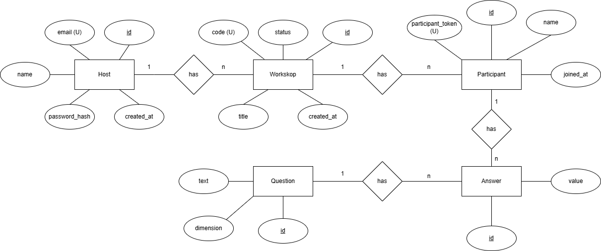

# Data model

=======

Die App besteht aus fünf zentralen Entitäten:

- **Host** (mit Login) erstellt und verwaltet Workshops
- **Workshop** ist eine konkrete Workshop-Instanz mit Join-Code und Status
- **Participant** tritt einem Workshop per Code bei und bekommt ein Token zur Wiedererkennung
- **Question** enthält die DISC-Fragen (inkl. Dimension D/I/S/C)
- **Answer** speichert die Antworten eines Teilnehmers zu einer Frage

## Host

Ein **Host** ist ein angemeldeter Benutzer der Anwendung. Er kann mehrere Workshops anlegen, verwalten und deren Team-Ergebnisse ansehen.

**Attribute:**
- `id` – eindeutige Host-ID
- `name` – Anzeigename des Hosts
- `email` (unique) – Login-Adresse
- `password_hash` – gehashtes Passwort (kein Klartext)
- `created_at` – Zeitpunkt der Registrierung

**Beziehungen:**
- Ein Host **hat viele** Workshops (1:n)

## Workshop

Ein **Workshop** ist eine Session, die vom Host erstellt wird. Teilnehmende treten über einen öffentlichen Code bei. Der Status ermöglicht später z. B. das Starten/Beenden eines Workshops.

**Attribute:**
- `id` – eindeutige Workshop-ID
- `code` (unique) – öffentlicher Beitrittscode
- `title` – Titel des Workshops
- `status` – Zustand (z. B. *created / running / finished*)
- `created_at` – Zeitpunkt der Erstellung

**Beziehungen:**
- Ein Workshop **gehört zu einem** Host (n:1)
- Ein Workshop **hat viele** Participants (1:n)

## Participant

Ein **Participant** ist eine Person, die einem Workshop beitritt, ohne einen eigenen Account zu benötigen. Das `participant_token` dient zur eindeutigen Wiedererkennung (z. B. um eine Sitzung fortzusetzen), ohne dass ein Login nötig ist.

**Attribute:**
- `id` – eindeutige Teilnehmer-ID
- `name` – Name der Person
- `participant_token` (unique) – Token zur Wiedererkennung
- `joined_at` – Zeitpunkt des Beitritts

**Beziehungen:**
- Ein Participant **gehört zu einem** Workshop (n:1)
- Ein Participant **hat viele** Answers (1:n)

## Question

Eine **Question** ist eine DISC-Frage. Die `dimension` ordnet jede Frage einer DISC-Kategorie zu (D, I, S oder C). Fragen sind im aktuellen Modell **global** und können in jedem Workshop verwendet werden.

**Attribute:**
- `id` – eindeutige Frage-ID
- `text` – Fragetext
- `dimension` – DISC-Dimension (*D, I, S, C*)

**Beziehungen:**
- Eine Question **hat viele** Answers (1:n)

## Answer

Ein **Answer** speichert die konkrete Antwort eines Teilnehmers zu einer bestimmten Frage. Die Antworten sind notwendig, um später Team-Ergebnisse zu aggregieren (z. B. Summen/Durchschnitte pro Dimension), ohne dass Teilnehmende ihre individuellen Ergebnisse sehen müssen.

**Attribute:**
- `id` – eindeutige Antwort-ID
- `value` – numerischer Antwortwert (z. B. Skala 1–5)

**Beziehungen:**
- Ein Answer **gehört zu einem** Participant (n:1)
- Ein Answer **gehört zu einer** Question (n:1)

## Hinweis zur Auswertung (Team Aggregat)

Die Datenbank speichert Antworten **pro Participant**, damit Auswertungen korrekt berechnet werden können. In der Anwendung werden jedoch später ausschließlich **aggregierte Team-Ergebnisse** dargestellt (z. B. pro Workshop und DISC-Dimension), nicht die individuellen Resultate einzelner Teilnehmer.
