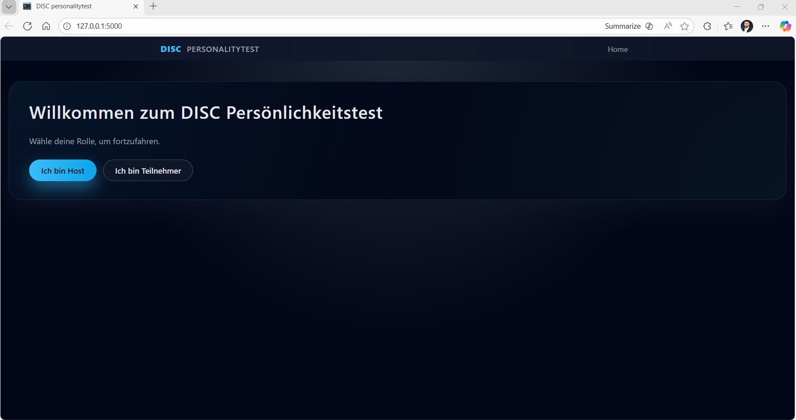
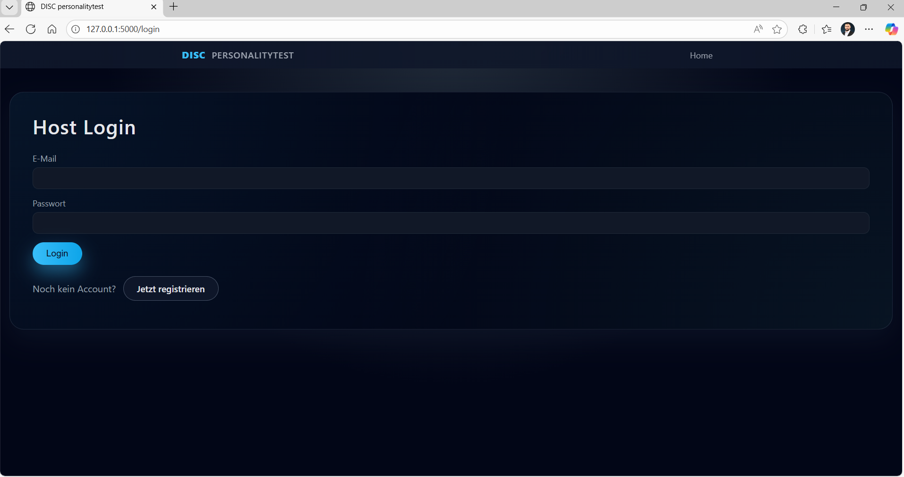
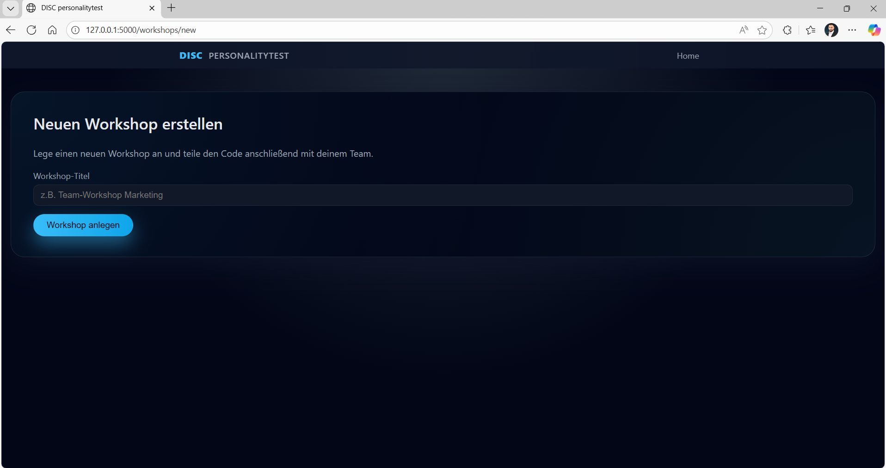
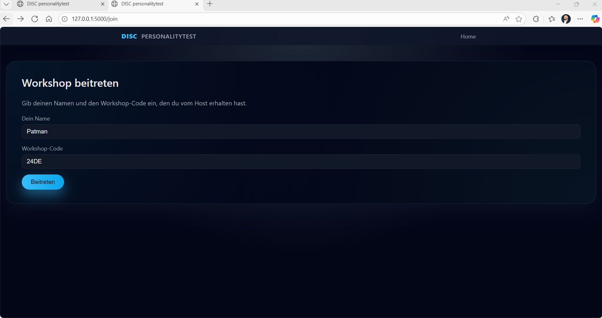
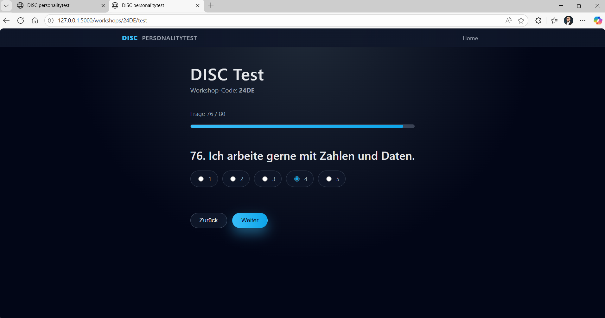
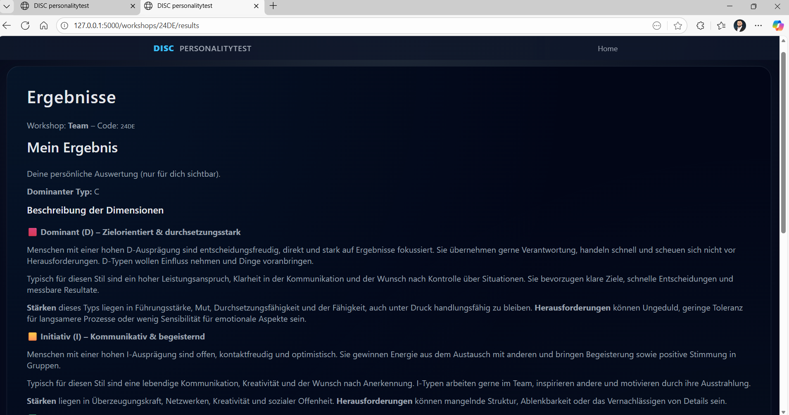
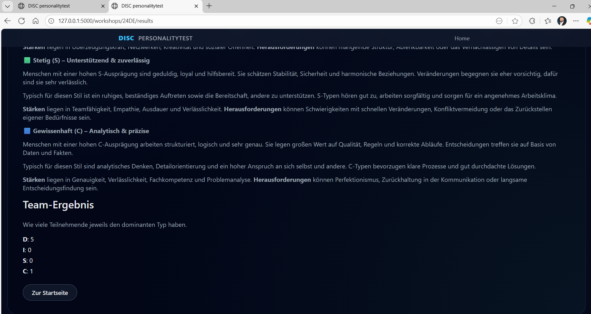

{: .label }
[Jane Dane]

{: .no_toc }
# Reference documentation

{: .text-delta }

Table of contents

+ ToC
{: toc }

## Home

**Route:** `/`

**Methods:** `GET`

**Purpose:** Homescreen; der Nutzer gibt an ob er Host oder Teilnehmer ist

**Sample output:**

---
# Host-Screens

## Host Login

**Route:** `/login`

**Methods:** `GET`

**Purpose:** Login für den Host; Weiterleitung auf Registrierung falls kein Account aneglegt

**Sample output:**

---

## Host Register

**Route:** `/register`

**Methods:** `GET`

**Purpose:** Registrierung für einen neuen Host Account

**Sample output:**

---

## Host Dashboard

**Route:** `/dashboard`

**Methods:** `GET`

**Purpose:** Liste mit allen erstellten Workshops; Weiterleiten zum erstellen eines neuen

**Sample output:** 

---

## Create Workshop

**Route:** `/workshops/new`

**Methods:** `GET`

**Purpose:** Registrierung für einen neuen Host Account

**Sample output:**

---

## Overview Workshop

**Route:** `/workshops/<code>/new`

**Methods:** `GET`

**Purpose:** Der Host hat eine Übersicht über den erstellten Workshop und sieht: code, status, Team Ergebnisse und die Teilnehmer

**Sample output:**

---

# Teilnehmer-Screens

## Join Workshop

**Route:** `/join`

**Methods:** `GET`

**Purpose:** Der Teilnehmer gibt seinen Namen und den Workshop Code ein

**Sample output:**

---

## Test

**Route:** `/workshops/<code>/test`

**Methods:** `GET`

**Purpose:** Der Teilnehmer beantwortet die Fragen(1(trifft gar nicht zu) bis 5(trifft voll und gaz zu))

**Sample output:**

---

## Ergebnisse

**Route:** `/workshops/<code>/test`

**Methods:** `GET`

**Purpose:** Der Teilnehmer sieht seine eigenen Ergebnisse, die Ergebnisse des Teams und einen Informationstext zu den unterschiedlichen Typen

**Sample output:**

